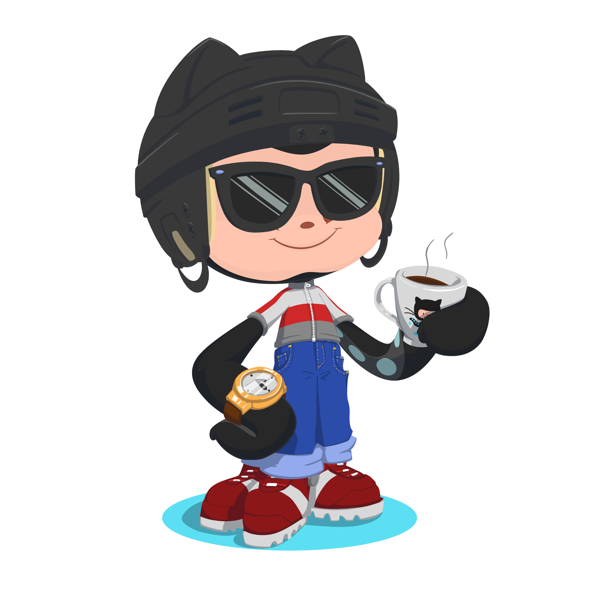

<!---GitHub README --->
<!--MetaTag-->
<meta name="keywords" content="Ariful Islam Arman, Full-Stack Web Developer, MERN Stack, MongoDB, Express.js, React, Node.js, JavaScript, HTML, CSS, Tailwind CSS, Bootstrap, MySQL, Web Development, Responsive Design, Frontend Developer, Backend Developer, Web Applications, Clean Code, API Development, Next.js, EJS, User Experience, JavaScript Developer, Web Performance, UI/UX Design, ARU,Aru Bomber,Mr.Aru, Itz Aru, Ariful Islam,aru github,Aru-Bomber,sms bomber">
<meta name="description" content="Ariful Islam Arman is a passionate Full-Stack Web Developer skilled in the MERN stack, including MongoDB, Express.js, React, and Node.js. He specializes in building clean, responsive, and high-performance websites and web applications. Let's collaborate and turn your ideas into reality with quality code and smooth user experiences.">

    

 
 

<b>Hi, I’m Ariful Islam Arman — a passionate Full-Stack Web Developer skilled in HTML, CSS, Tailwind, Bootstrap, JavaScript, React, Next.js, Express.js, MongoDB, MySQL, and more. I specialize in building clean, responsive, and user-friendly websites with a strong focus on performance and modern design. Let’s bring your ideas to life with quality code and a smooth user experience. Feel free to reach out anytime!</b>

 
 

` ⚙️ GitHub Analytics`

 

`😇 About Ariful Islam Arman: `

 

<b> 🖥️ Iam a Student and A part time Programmer</b>
 
 

<ul>
<li>🇧🇩 Resident of Bangladesh</li>
<li>😇 Muslim </li>
<li>😪 Love Coding </li>
<li>💔 Born Single </li>
<li>☹️ Aim: Become a software engineer</li>
</ul>
 

`😇 My Skills: `

  
  
  
  
  
  
  
  
  
  
  
  
  
  
  
  
  
     

`📡 Get in Touch`
 

Made With ❤️ by <a href="https://m.me/1r13a14">Ariful Islam Arman</a> 

